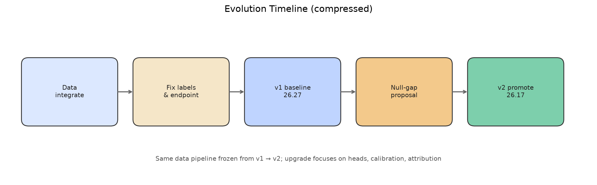
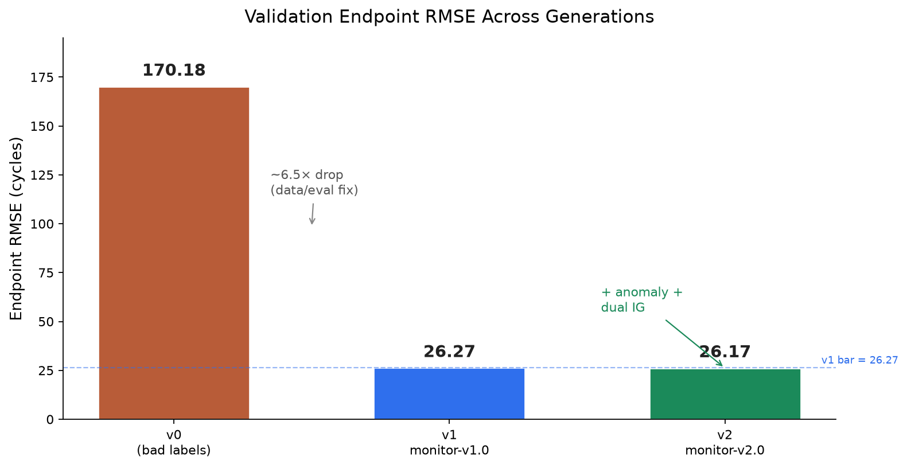
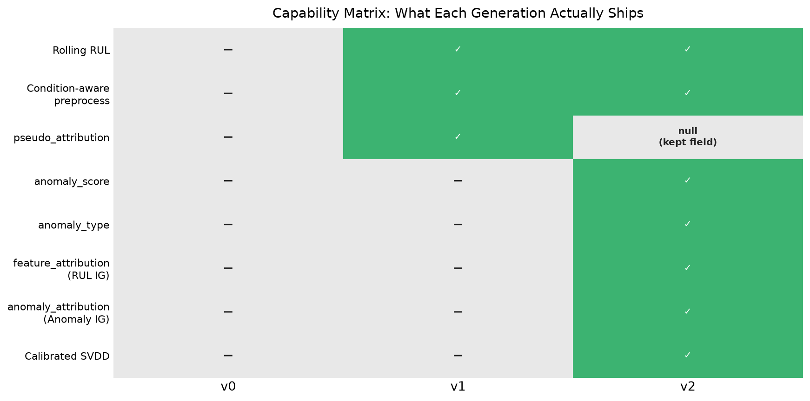
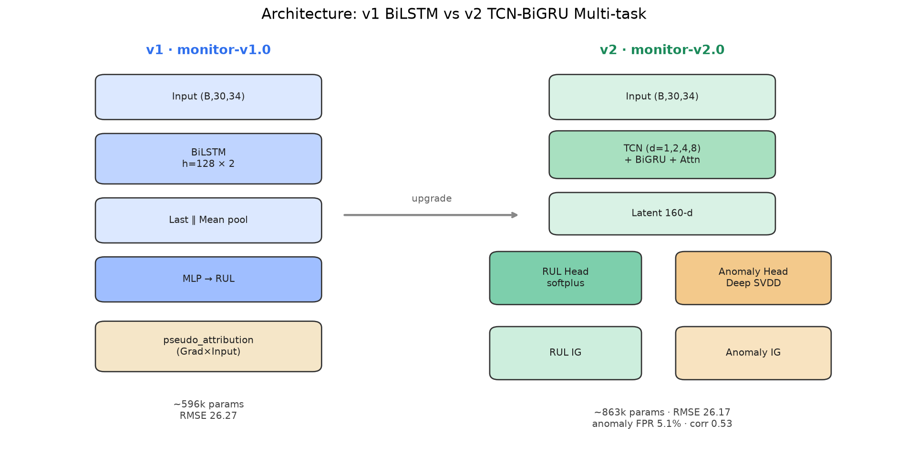
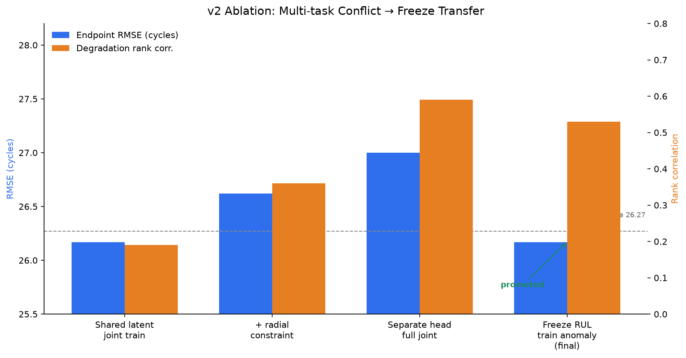
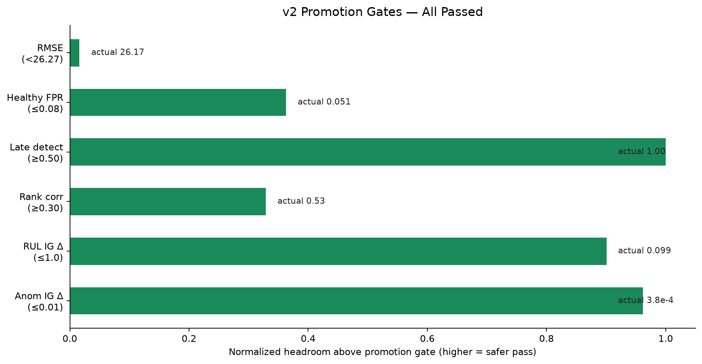
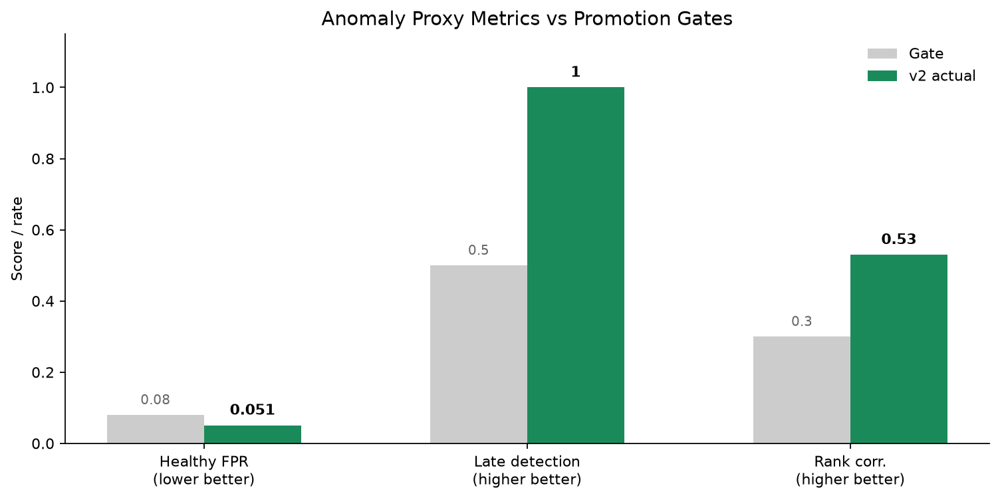
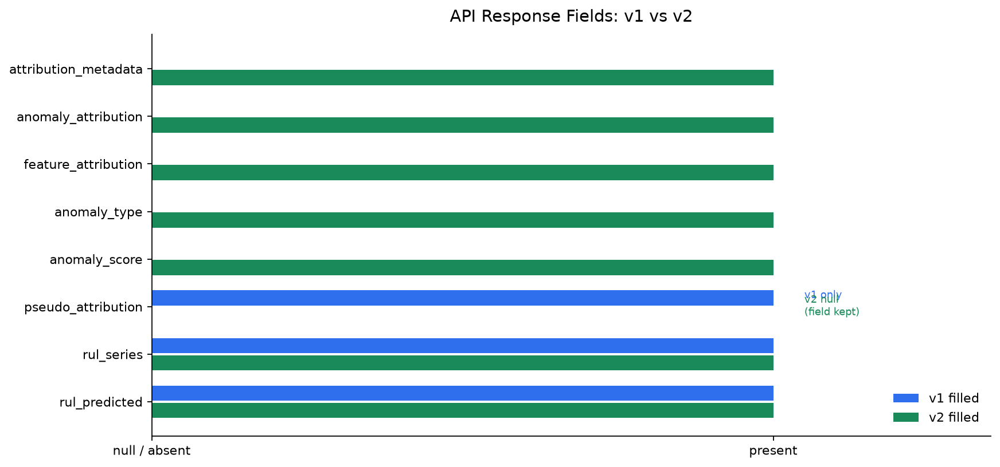
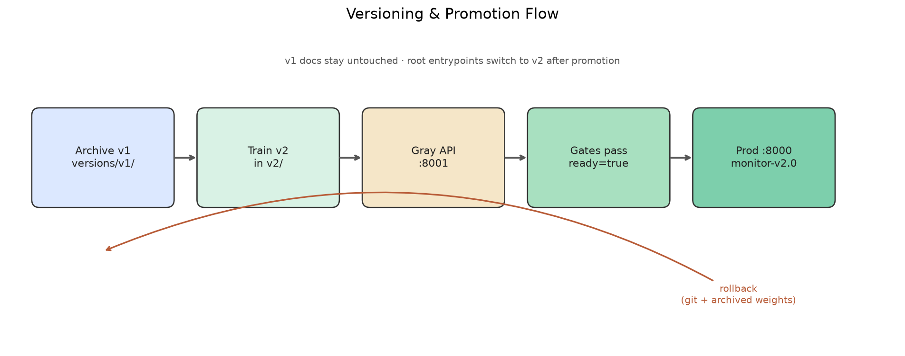

# IndusMind · 涡扇发动机监测（v0 → v1 → v2）

NASA C-MAPSS 全家族 + PHM08 整合数据上的剩余寿命（RUL）预测与异常监测系统。  
当前线上版本：**`monitor-v2.0`**（端点 RMSE **26.17** cycles，含异常分与双 Integrated Gradients）。

> 本 README 是项目入口，完整记录从错误标签、v1 基线到 v2 多任务晋级的进化过程。  
>
> 配套阅读：  
> [`MODEL_EVOLUTION.md`](MODEL_EVOLUTION.md) · [`API_CONTRACT.md`](API_CONTRACT.md) · [`ANOMALY_DETECTION_PROPOSAL.md`](ANOMALY_DETECTION_PROPOSAL.md) · [`v2/README.md`](v2/README.md) · [`integrated/DATASET.md`](integrated/DATASET.md) · [`versions/v1/SNAPSHOT.md`](versions/v1/SNAPSHOT.md)

<p align="center">
  
</p>

---

## 目录

1. [一句话结论](#0-一句话结论)
2. [快速开始](#快速开始)
3. [文档地图](#1-文档地图)
4. [进化时间线](#2-进化时间线)
5. [数据底座](#3-数据底座从单个子集到全家族)
6. [v0：失败但价值极高](#4-v0失败但价值极高)
7. [v1：可靠 RUL 基线](#5-v1可靠-rul-基线)
8. [升级动机：v1 够用吗](#6-升级动机v1-已经够用吗)
9. [v2 架构详解](#7-v2-架构共享编码器独立任务头)
10. [训练、消融与晋级](#8-训练消融与晋级门槛)
11. [API 能力跃迁](#9-api向后兼容的能力跃迁)
12. [部署、版本与回滚](#10-部署版本策略与回滚)
13. [能力对照总表](#11-能力对照总表-v0--v1--v2)
14. [进化原则](#12-进化原则贯穿三次跃迁)
15. [仓库现状地图](#13-仓库现状地图)
16. [数字收束](#14-数字收束三次跃迁各赢在哪里)
17. [下一跳](#15-下一跳建议在-v2-冻结后)
18. [附录：完整响应示例与指标口径](#16-附录完整响应示例与指标口径)

---

## 0. 一句话结论

IndusMind 不是「一次换更大网络」的故事，而是三次本质不同的跃迁：

| 阶段 | 版本号 | 核心产物 | 端点 RMSE | 异常 / 正式归因 | 可上线 |
|------|--------|----------|-----------|-----------------|--------|
| **v0** | 无正式版本 | 错误标签上的 BiLSTM | ≈ **170** cycles（不可信） | 无 | 否 |
| **v1** | `monitor-v1.0` | 数据管道修好的 RUL 基线 | **26.27** cycles | 伪归因；异常字段 `null` | 是 |
| **v2** | `monitor-v2.0` | 共享编码器 + 独立异常头 + 双 IG | **26.17** cycles | 正式异常分 + 双套归因 | **是（已晋级）** |

<p align="center">
  
</p>

相对 v0：误差约下降 **6.5×**（主要靠修标签与评估协议）。  
相对 v1：RUL 再抠 **0.10 cycles**，同时把 API 里长期为 `null` 的异常与正式归因能力真正填满。

当前线上：

```text
POST http://127.0.0.1:8000/api/v1/monitor/analyze
model_version = monitor-v2.0
anomaly_calibrated = true
```

<p align="center">
  
</p>

---

## 快速开始

### 环境

```bash
cd /Users/tincl/indus_data
uv sync
```

### 预处理（已跑过可跳过）

```bash
uv run python preprocess_integrated.py
```

### 训练（云上 GPU 推荐）

```bash
bash run_bitahub.sh
# 或
bash v2/run_train.sh
tail -f train.log   # 或 v2_train.log
```

### 离线推理

```bash
uv run python infer.py --n-examples 5
```

### 启动监测 API

```bash
bash run_api.sh
# → http://127.0.0.1:8000/health
# → http://127.0.0.1:8000/docs
```

跨机调用需 SSH 隧道 + 前端代理，见 [`API_CONTRACT.md`](API_CONTRACT.md)（v1 历史契约）与下文第 9 节（v2 实际行为）。

---

## 1. 文档地图

项目演进中形成了多份文档，各司其职：

| 文档 | 时代 | 回答的问题 |
|------|------|------------|
| **本 README** | v0→v2 总览 | 项目入口、进化全叙事、当前能力 |
| [`integrated/DATASET.md`](integrated/DATASET.md) | 数据整合期 | 这套数据为什么「够硬」 |
| [`MODEL_EVOLUTION.md`](MODEL_EVOLUTION.md) | v1 详版 | 为什么从 170 到 26.3 |
| [`API_CONTRACT.md`](API_CONTRACT.md) | v1 契约原文 | 前端怎么调（历史；异常字段曾为 null） |
| [`ANOMALY_DETECTION_PROPOSAL.md`](ANOMALY_DETECTION_PROPOSAL.md) | v1→v2 前夜 | 异常能力缺口与最小补全提案 |
| [`v2/README.md`](v2/README.md) | v2 包 | 新训练 / 灰度 / 晋级规则 |
| [`versions/v1/SNAPSHOT.md`](versions/v1/SNAPSHOT.md) | 版本策略 | 如何回滚 |

**文档策略：**

- v1 时代专项文档保持原貌，作为历史真相；
- 本 README 记录升级后的全局真相与当前默认行为；
- 不用「改旧文档」假装从未走过弯路。

---

## 2. 进化时间线

<p align="center">
  
</p>

```text
[数据整合]
  FD001
    → FD001–004 + PHM08 整合三件套
    → 工况聚类归一化 + dataset/condition one-hot
    → 发动机均衡采样 + 端点评估

[标签与评估]
  验证 RUL 写反（大量负标签）→ 「假过拟合」、Val ≈ 170 cycles
    → 修公式 + 非负断言 + 端点 RMSE
    → v1：26.27 cycles，可上线

[产品化 v1]
  infer.py
    → POST /api/v1/monitor/analyze
    → RUL + pseudo_attribution
    → anomaly_* / feature_attribution = null（诚实不伪造）

[能力缺口确认]
  ANOMALY_DETECTION_PROPOSAL：
    问题不是「再调 RUL」，而是缺少独立异常表征与正式归因

[v2 研发]
  共享 TCN-BiGRU 编码器
    + RUL 头
    + 工况感知 Deep SVDD 异常头
    + 双 Integrated Gradients
    + 发动机级校准拆分
    + 代理异常指标 + 归因完整性验收

[晋级]
  8001 灰度验证通过
    → 8000 默认服务切换为 monitor-v2.0
    → v1 代码/权重归档到 versions/v1/
    → 根目录入口指向 v2，旧文档保留不动
```

---

## 3. 数据底座：从单个子集到全家族

### 3.1 为什么数据是第一阶段进化

没有正确的数据契约，任何后续模型升级都是噪声。  
整合集把 NASA C-MAPSS 全家族与 PHM08 训练轨迹拉到同一 schema：

<p align="center">
  
</p>

| 指标 | 仅 FD001 | 整合集 |
|------|----------|--------|
| 训练发动机 | 100 | **927** |
| 训练原始行 | ~2.1 万 | **~20.6 万** |
| 验证发动机（有公开 RUL） | 100 | **707** |
| 工况 | 1 | 1 与 6 |
| 故障模式 | 1 | 1 与 2 |
| 训练寿命跨度 | 较短 | 128–543 cycles（中位约 207） |

原始三件套：

```text
integrated/train_integrated.txt
integrated/val_integrated.txt
integrated/RUL_integrated.txt
integrated/integrated_unit_map.csv
```

列定义与官方一致：`unit | cycle | op1–3 | sensor1–21`。

### 3.2 子集角色（难度光谱）

| 来源 | 训练机数 | 角色 |
|------|----------|------|
| FD001 | 100 | 单工况 × 单故障，冒烟金标准 |
| FD002 | 260 | 六工况 × 单故障，工况漂移杀手 |
| FD003 | 100 | 单工况 × 双故障，退化形态分叉 |
| FD004 | 249 | 六工况 × 双故障，经典最终 Boss |
| PHM08 train | 218 | 竞赛增广（无公开测试 RUL） |
| **合计** | **927** | 训练行数 ≈ 20.6 万 |

验证：FD001–004 官方测试合成，**707** 台带公开 RUL；端点评估可用约 **690** 台（长度不足 30 的自然排除）。

### 3.3 预处理为何决定上限

| 能力 | 旧 | v1 / v2 共用管道 |
|------|----|------------------|
| 验证 RUL | `cycle + final - max`（错） | `final + max - cycle`（对） |
| 传感器归一化 | 全局 StandardScaler | **6 工况聚类**内标准化 |
| 域信息 | 无 | `dataset` one-hot（FD001–004 / PHM08） |
| 工况信息 | 仅原始 op | `condition` one-hot |
| 特征维 | ≈ 23 | **34** |
| 采样 | 长寿命机占优 | **发动机均衡** WeightedRandomSampler |
| 评估 | 全窗口 RMSE | **每台末窗口端点 RMSE** |

处理后规模：

```text
X_train: (179394, 30, 34)
X_val:   (84478, 30, 34)
端点验证可用发动机: ~690
max_rul: 542
feature_names: 20 sensors + 3 op + 5 dataset + 6 condition = 34
```

**关键原则：v2 没有改数据管道。**  
升级发生在模型头、损失、校准与归因层；数据契约冻结，保证 v1 / v2 可比。

---

## 4. v0：失败，但价值极高

### 4.1 现象

ModelArts Tesla V100 初训：

```text
Train loss 持续下降 → ~0.04
Val 卡在 ~0.31–0.34
反算原始 RMSE ≈ 170 cycles
曲线看起来像「严重过拟合」
```

<p align="center">
  
</p>

### 4.2 真正根因

不是「模型太大」，而是：

1. 验证 RUL 公式符号错误 → **过半验证窗口为负标签**
2. 输出 ReLU 无法拟合负目标 → 验证误差有理论下界
3. 训练 / 验证目标定义不一致 → Train↓ Val↑ 被误读成过拟合

### 4.3 留下的工程教训

1. **先契约后模型**：标签错时调参无效。  
2. **断言非负 RUL**：错误标签不得静默上线。  
3. **端点评估**：与 CMAPSS 社区对齐，避免长轨迹权重污染。  
4. **CUDA 不可用直接失败**：云上禁止静默掉 CPU。  
5. **最佳检查点 ≠ 最后一轮**：后续 v1 最佳在 epoch 1，再次印证。

这一阶段的意义：暴露了「只看 Train↓ Val↑」会误判；**先修数据契约，再谈结构**。

---

## 5. v1：可靠 RUL 基线

### 5.1 模型结构

```text
Input (B, 30, 34)
  → BiLSTM (hidden=128, layers=2, dropout=0.3)
  → Last state ∥ Mean pool
  → Linear 512→64→1 + ReLU
  → × max_rul → cycles
```

约 **596k** 参数。刻意保持「中等」：算力花在数据正确性，而不是堆 Transformer。

### 5.2 训练结果（Bitahub RTX 4090）

<p align="center">
  
</p>

```text
Best RMSE (norm):     0.0485
Best RMSE (original): 26.27 cycles
Best epoch:           1
Early stop:           epoch 26
Speed:                ~6–9 s/epoch
Params:               ~596,097
Max RUL:              542
```

训练动态：

- epoch 1 即最佳端点 RMSE  
- 之后 Train 继续降（约 0.07 → 0.026），Val 在 0.05–0.065 徘徊  
- 说明：进一步压训练误差未转化为端点泛化  
- 早停正确保住 epoch 1 检查点  

### 5.3 产品能力矩阵（v1）

| 能力 | 状态 |
|------|------|
| 滚动 / 单点 RUL | ✅ |
| 工况感知预处理 | ✅ |
| `pseudo_attribution`（Gradient × Input） | ✅ |
| 独立 `anomaly_score` / `anomaly_type` | ❌ → `null` |
| 正式 `feature_attribution` | ❌ → `null` |
| 统一监测 API | ✅ `monitor-v1.0` |

### 5.4 v1 的诚实边界

v1 文档与 API 明确约定：

> 没有独立异常模型，就返回 `null`，绝不把 RUL 阈值或 RUL 梯度伪装成异常概率。

这是后续能干净升级到 v2 的前提：契约诚实，前端不会建立错误假设。

### 5.5 v1 归档快照

| 项 | 值 |
|----|----|
| Git commit | `24f749a820f488705ea719e0f6dfaaf8dc169cd8` |
| 模型版本 | `monitor-v1.0` |
| 最佳端点 RMSE | `26.27 cycles` |
| 权重归档 | `versions/v1/model/saved/` |
| 文档策略 | 根目录 v1 文档 **保持原样不动** |

---

## 6. 升级动机：v1 已经够用吗？

### 6.1 v1 已经回答的问题

> 根据最近 30 个周期的工况与传感器，设备预计还能运行多少 cycles？

有效输出：`rul_predicted` · `rul_series` · `pseudo_attribution`

### 6.2 v1 不能回答的问题

1. 当前设备偏离健康状态的程度是多少？  
2. 当前异常属于什么类型？  
3. 哪些传感器导致了异常判断？  

`pseudo_attribution` 只解释 **RUL 预测敏感度**，不解释 **异常判断**。

必须区分：

| 字段 | 解释对象 | v1 状态 |
|------|----------|---------|
| `pseudo_attribution` | 哪些特征影响 RUL 预测 | 已实现 |
| `feature_attribution` | 哪些特征导致异常 / 正式解释 | 未实现 |

### 6.3 提案阶段的最小方案

[`ANOMALY_DETECTION_PROPOSAL.md`](ANOMALY_DETECTION_PROPOSAL.md) 提出：

> 工况感知健康基线 + Z-score 异常检测 + 同源正式归因

原则：不重训 RUL、不伪造异常概率、按工况建基线。

### 6.4 为什么最终没有停在 Z-score

Z-score 方案改动最小、语义正确，但仍是 **输入空间统计偏离**，与 RUL 编码器脱节。  
最终选择更强但可验收的路线：

> **共享时序编码器 + 独立异常投影头（Deep SVDD）+ 双 Integrated Gradients**

这样：

- `anomaly_score` 来自学习到的表征距离，而不是手写阈值包装  
- `feature_attribution` 正式解释 RUL  
- `anomaly_attribution` 正式解释异常  
- RUL 与异常语义分离，避免「用寿命冒充异常」

---

## 7. v2 架构：共享编码器，独立任务头

<p align="center">
  
</p>

### 7.1 网络总览

```text
Input (B, 30, 34)
  → Linear projection → TCN (dilation 1,2,4,8)
  → BiGRU
  → AttentionPool ∥ Last
  → Latent (160-d)
        ├── RUL Head → softplus → 归一化 RUL
        └── Anomaly Head (Linear, 128-d, 可 detach)
              → 与工况 SVDD 中心距离 → anomaly_distance
```

| 模块 | 配置 | 作用 |
|------|------|------|
| TCN | channels=144，dilation=1/2/4/8 | 多尺度局部时序模式 |
| BiGRU | hidden=128，1 层双向 | 长程依赖 |
| AttentionPooling | 可学习时间权重 | 突出关键周期 |
| Latent | 160-d + LayerNorm | 共享语义瓶颈 |
| RUL Head | 160→64→1 + softplus | 非负归一化寿命 |
| Anomaly Head | 160→128（无 bias） | 工况 SVDD 空间 |
| 参数量 | ≈ **862,866** | 含独立异常投影头 |

### 7.2 为什么要「共享编码器 + 独立异常头」

早期联合训练实验揭示了多任务冲突：

<p align="center">
  
</p>

| 实验配置 | 端点 RMSE | 异常代理相关性 | 健康误报 | 结论 |
|----------|-----------|----------------|----------|------|
| 共享潜变量联合训 | **26.17** | ~0.19 | 低 | RUL 好，异常排序不足 |
| 共享潜变量 + 径向约束 | 26.62 | ~0.36 | 中 | 异常变好，RUL 掉出门槛 |
| 独立异常头但全量联合训 | 27.00 | **0.59** | 中 | 冲突仍伤 RUL |
| **冻结 RUL，只训 anomaly_head** | **26.17** | **0.53** | **5.1%** | **双目标同时过线** |

最终生产策略：

1. 先训出并保住端点 RMSE = **26.17** 的 RUL 编码器；  
2. 冻结编码器与 RUL 头；  
3. 只训练 `anomaly_head` + 工况 SVDD 中心 / 校准；  
4. 推理时异常梯度可回传整网，供 Integrated Gradients 使用。

这是 v2 最关键的工程洞察：

> **不要让异常损失直接毁掉已经验证过的 RUL 精度。**

### 7.3 Deep SVDD 与工况感知

- 6 个工况各自一个 SVDD 中心  
- 健康窗口定义：`RUL ≥ 125`（C-MAPSS 常用健康段截断）  
- 训练中对健康样本压近中心（SVDD 损失）  
- 额外小权重径向损失，鼓励退化样本距离随严重度增大  
- 校准集按发动机拆分（约 10%），**不参与梯度更新**

校准产物写入检查点：

```text
distance_quantiles[condition]      # 经验分位数曲线
healthy_sensor_baselines[condition]# IG 基线
threshold = 0.95                   # 告警阈值
```

打分逻辑：

```text
anomaly_score = quantile_map(anomaly_distance | condition)
```

类型：

| 条件 | `anomaly_type` |
|------|----------------|
| `anomaly_score < 0.95` | `normal` |
| `anomaly_score ≥ 0.95` | `condition_representation_deviation` |

### 7.4 双 Integrated Gradients

| 字段 | 解释对象 | 方法 | 基线 |
|------|----------|------|------|
| `feature_attribution` | 哪些传感器推高/压低 RUL | IG on RUL | 工况健康传感器均值 |
| `anomaly_attribution` | 哪些传感器推高异常距离 | IG on distance | 同上 |
| `pseudo_attribution` | v1 伪归因 | — | v2 保留字段，返回 `null` |

验收：完整性误差（prediction gap vs attribution sum）必须足够小。  
最终：

```text
RUL IG max |Δ|     = 0.099   (门槛 ≤ 1.0)
Anomaly IG max |Δ| = 3.8e-4  (门槛 ≤ 0.01)
```

### 7.5 检查点 schema

v2 检查点要求：

```text
schema_version = 2
model_version = monitor-v2.0
model_state_dict
model_kwargs
max_rul / seq_length / feature_names
anomaly_calibration
anomaly_proxy_metrics
attribution_validation
training_args
```

API 启动时若缺少 `schema_version=2` 或校准信息，直接失败——禁止静默降级成假异常。

---

## 8. 训练、消融与晋级门槛

### 8.1 训练流程（最终生产路径）

```text
1) Warmup / 或加载已验证 RUL 检查点
2) 用健康训练窗口初始化工况 SVDD 中心
3) 若 rul-checkpoint 存在：冻结主体，只训 anomaly_head
4) 校准：健康校准集 → 分位数 / IG 基线
5) 代理异常评估 + 归因完整性评估
6) 写 metadata.json，判定 ready_for_promotion
```

关键超参（最终）：

| 项 | 值 |
|----|----|
| batch size | 512 |
| lr（异常头阶段） | 1e-3 → 衰减 |
| svdd_weight | 0.05 |
| degradation_weight | 0.02 |
| healthy_rul | 125 |
| calibration_fraction | 0.10 |
| IG steps | 32 |

### 8.2 晋级条件（全部必须满足）

<p align="center">
  
</p>

<p align="center">
  
</p>

| 门槛 | 要求 | 最终结果 | 状态 |
|------|------|----------|------|
| 端点 RMSE | **严格 < 26.27** | **26.17** | ✅ |
| 健康误报率 | ≤ 0.08 | **0.051** | ✅ |
| 晚期检出率（RUL≤30 代理） | ≥ 0.50 | **1.00** | ✅ |
| 退化排序相关性 | ≥ 0.30 | **0.53** | ✅ |
| RUL IG 完整性 | max abs delta ≤ 1.0 | **0.099** | ✅ |
| 异常 IG 完整性 | max abs delta ≤ 0.01 | **3.8e-4** | ✅ |

最终 metadata（摘要）：

```json
{
  "model_version": "monitor-v2.0",
  "best_rmse_cycles": 26.168465506340294,
  "v1_rmse_cycles": 26.27,
  "improvement_cycles": 0.10153449365970602,
  "ready_for_promotion": true,
  "anomaly_proxy_metrics": {
    "healthy_false_positive_rate": 0.051029922861744514,
    "late_detection_rate": 1.0,
    "degradation_rank_correlation": 0.5302508596736271,
    "proxy_passed": true
  },
  "attribution_validation": {
    "rul_max_abs_completeness_delta": 0.09918212890625,
    "anomaly_max_abs_completeness_delta": 0.0003826022148132324,
    "attribution_passed": true
  }
}
```

### 8.3 重要限制（必须写进产品认知）

异常指标当前基于 **RUL 退化代理**，不是真实故障起始标注：

| 代理指标 | 含义 |
|----------|------|
| 健康误报率 | `RUL ≥ 125` 窗口被判异常的比例 |
| 晚期检出率 | `RUL ≤ 30` 窗口被判异常的比例 |
| 相关性 | 异常分数排序与退化严重度排序是否同向 |

因此：

> `anomaly_score` 是 **工况校正后的表征偏离分位数**，不是「故障概率」。

要升级成监督故障概率，需要 N-CMAPSS 一类带 `health_state` / 故障类别的数据。

---

## 9. API：向后兼容的能力跃迁

### 9.1 路径不变

```http
POST /api/v1/monitor/analyze
GET  /health
```

请求体与 v1 完全相同：  
必填 `device_id` · `device_model` · `sensor_data`(≥30，推荐 128) · `operating_settings` · `dataset`。

缺 `operating_settings` / `dataset` → **422**，服务端绝不猜测。

### 9.2 响应字段对比

<p align="center">
  
</p>

| 字段 | v1 (`monitor-v1.0`) | v2 (`monitor-v2.0`) |
|------|---------------------|---------------------|
| `rul_predicted` / `rul_series` | ✅ | ✅ |
| `anomaly_score` | `null` | ✅ 0–1 |
| `anomaly_type` | `null` | ✅ `normal` / `condition_representation_deviation` |
| `feature_attribution` | `null` | ✅ RUL 的 IG Top-K |
| `pseudo_attribution` | ✅ Gradient×Input | 保留字段，返回 `null` |
| `anomaly_attribution` | 无 | ✅ 异常的 IG Top-K（新增可选） |
| `attribution_metadata` | 无 | ✅ method / baseline / completeness |

### 9.3 健康检查升级

v1：

```json
{"status":"ok","model_version":"monitor-v1.0","device":"cuda"}
```

v2：

```json
{
  "status": "ok",
  "model_version": "monitor-v2.0",
  "device": "cuda",
  "anomaly_calibrated": true
}
```

### 9.4 前端迁移建议

1. 继续读 `rul_predicted` / `rul_series`——零改动。  
2. 告警优先读 `anomaly_score` / `anomaly_type`，不再用临时 RUL 阈值硬凑异常。  
3. RUL 解释卡片读 `feature_attribution`。  
4. 异常解释卡片读 `anomaly_attribution`。  
5. 两套归因 **不要合并展示**。  
6. `pseudo_attribution` 在 v2 为 `null`，不要回退依赖它。  
7. 旧调用方即使忽略新字段，也不会破坏。

> 说明：根目录 [`API_CONTRACT.md`](API_CONTRACT.md) 仍是 v1 时代契约原文，刻意保留；线上行为以 v2 实现与本文第 9 节 / 附录为准。

---

## 10. 部署、版本策略与回滚

<p align="center">
  
</p>

### 10.1 版本策略（执行结果）

| 原则 | 落地 |
|------|------|
| v2 独立研发 | `v2/` 包：model / train / attribution / api / validate |
| v1 文档不动 | README / MODEL_EVOLUTION / API_CONTRACT 等保持原貌 |
| v1 可回滚 | `versions/v1/SNAPSHOT.md` + 权重归档 |
| 灰度再替换 | 先 `8001`，通过后切 `8000` |
| 根目录入口指向新默认 | `api.py` / `train.py` / `infer.py` 成为 v2 薄入口 |

### 10.2 当前线上状态

| 项 | 值 |
|----|----|
| 端口 | `8000` |
| 进程 | `uvicorn api:app` |
| 检查点 | `model/saved/best_model.pt`（schema v2） |
| 模型版本 | `monitor-v2.0` |
| GPU | RTX 4090 |
| v1 权重备份 | `versions/v1/model/saved/` |

### 10.3 回滚路径

代码：

```bash
git checkout 24f749a820f488705ea719e0f6dfaaf8dc169cd8 -- \
  api.py infer.py launcher.py lstm_transformer.py \
  preprocess_integrated.py run_api.sh run_bitahub.sh train.py
```

权重：

```bash
cp versions/v1/model/saved/best_model.pt model/saved/best_model.pt
# 重启 run_api.sh，MODEL_VERSION=monitor-v1.0
```

---

## 11. 能力对照总表（v0 / v1 / v2）

| 维度 | v0 | v1 | v2 |
|------|----|----|----|
| 数据 | 整合集初版（坏标签） | 修好的全家族管道 | **同管道冻结** |
| 网络 | BiLSTM | BiLSTM ~596k | TCN-BiGRU + 双头 ~863k |
| 端点 RMSE | ≈170（不可信） | 26.27 | **26.17** |
| 评估协议 | 全窗口 / 错误标签 | 端点 RMSE | 端点 RMSE + 异常代理 + IG 完整性 |
| RUL API | 无 / 脚本 | ✅ | ✅ |
| 伪归因 | 无 | ✅ | 字段保留为 null |
| 正式 RUL 归因 | 无 | 无 | ✅ Integrated Gradients |
| 异常分数 | 无 | null | ✅ 工况分位数校准 |
| 异常类型 | 无 | null | ✅ 最小可解释两类 |
| 异常归因 | 无 | 无 | ✅ Integrated Gradients |
| 校准集隔离 | 无 | 无 | ✅ 发动机级拆分 |
| 版本化回滚 | 无 | 有快照 | 有快照 + 已晋级 |
| 文档诚实度 | 低（被假过拟合误导） | 高（null 不伪造） | 高（代理指标边界写明） |

---

## 12. 进化原则（贯穿三次跃迁）

1. **先契约后模型**  
   标签、归一化、评估协议错了，调参没有意义。

2. **指标与竞赛对齐**  
   联合训练可以，但主晋级指标必须是发动机端点 RMSE。

3. **不伪造能力**  
   v1 宁可返回 `null`，也不把 RUL 包装成异常。  
   v2 的异常分也明确写成「表征偏离分位数」，不是故障概率。

4. **共享表示，隔离冲突**  
   异常与 RUL 可以共享编码器，但训练时要防止异常损失毁掉 RUL。

5. **校准与训练解耦**  
   健康中心、分位数、IG 基线必须来自独立校准发动机，不能偷看验证集。

6. **最佳检查点信任验证，不信任训练曲线**  
   v1 最佳在 epoch 1；v2 最终靠冻结迁移保住 26.17。

7. **灰度 → 晋级 → 可回滚**  
   8001 验证通过才切 8000；v1 权重与 commit 永久可恢复。

8. **文档分层**  
   旧文档记录当时真相；新总结记录升级后的全局真相；不要用「改历史文档」假装从未走过弯路。

---

## 13. 仓库现状地图

```text
indus_data/
├── README.md                     ← 你在这里（项目入口 + 进化总览）
├── assets/                       ← README 配图
│   ├── timeline_strip.png
│   ├── rmse_v0_v1_v2.png
│   ├── capability_matrix.png
│   ├── architecture_v1_vs_v2.png
│   ├── ablation_journey.png
│   ├── promotion_gates.png
│   ├── anomaly_proxy_metrics.png
│   ├── api_fields_upgrade.png
│   ├── deploy_rollback_flow.png
│   ├── dataset_scale.png
│   ├── evolution_pipeline.png
│   ├── rmse_evolution.png
│   └── training_curve_v1.png
├── MODEL_EVOLUTION.md            ← v1 进化详版（历史）
├── API_CONTRACT.md               ← v1 契约原文（历史）
├── ANOMALY_DETECTION_PROPOSAL.md ← 升级前提案（历史）
├── integrated/                   ← 全家族原始三件套
├── processed/                    ← 34 维窗口张量（v1/v2 共用）
├── versions/v1/                  ← v1 代码快照说明 + 权重归档
├── v2/                           ← v2 完整实现包
│   ├── model.py                  ← TCN-BiGRU + SVDD
│   ├── train.py                  ← 联合 / 冻结迁移训练
│   ├── attribution.py            ← 双 IG
│   ├── api.py                    ← 兼容监测 API
│   ├── validate.py               ← 代理指标与归因验收
│   ├── infer.py                  ← 离线示例
│   └── README.md
├── api.py / train.py / infer.py  ← 生产薄入口 → v2
├── run_api.sh / run_bitahub.sh   ← 默认跑 v2
└── model/saved/                  ← 当前线上 monitor-v2.0
```

---

## 14. 数字收束：三次跃迁各赢在哪里

### 14.1 v0 → v1：从不可用到可用

```text
~170 cycles  →  26.27 cycles
```

赢在：

- 修标签  
- 工况感知归一化  
- 发动机均衡采样  
- 端点评估  
- 诚实 API  

### 14.2 v1 → v2：从「只会报寿命」到「寿命 + 异常 + 双归因」

```text
RUL: 26.27 → 26.17 cycles
异常: null → 校准分数 + 类型
归因: 伪归因 → 正式双 IG
```

赢在：

- 更强时序编码器  
- 独立异常投影头  
- 工况 SVDD + 校准  
- 冻结迁移避免多任务互伤  
- 灰度晋级与回滚体系  

### 14.3 仍然没赢的部分（诚实写）

- 尚无真实故障起始标签 → 异常仍是代理指标  
- 尚未按 FD001–004 分组公布端点 RMSE / NASA Score  
- `anomaly_type` 仍是最小二分类，不是部件级诊断  
- [`API_CONTRACT.md`](API_CONTRACT.md) 仍是 v1 历史契约；v2 字段以本 README 第 9 节 / 附录为准

---

## 15. 下一跳建议（在 v2 冻结后）

| 优先级 | 方向 | 目的 |
|--------|------|------|
| P0 | 按 FD001–004 **分组**报告端点 RMSE / NASA Score | 看清多工况短板 |
| P1 | 将 [`API_CONTRACT.md`](API_CONTRACT.md) 增补 v2 附录（或新建 CONTRACT_v2） | 给前端正式契约 |
| P2 | RUL cap（如 125）+ 进一步损失消融 | 继续抠健康段误差 |
| P3 | 接入 N-CMAPSS `health_state` | 把代理异常升级为监督概率 |
| P4 | 故障部件分类头 | `anomaly_type` 从偏离 → 部件级诊断 |
| P5 | Agent / MCP Tool 封装 | 「像调 LLM 一样」调监测 |

---

## 16. 附录：完整响应示例与指标口径

### 16.1 v2 成功响应示例（结构）

```json
{
  "code": 0,
  "msg": "success",
  "data": {
    "event_id": "evt-20260101002900-34e7dd8c",
    "device_id": "gray-test-001",
    "device_model": "CMAPSS",
    "timestamp": "2026-01-01T00:29:00Z",
    "model_version": "monitor-v2.0",
    "anomaly_score": 0.46039,
    "anomaly_type": "normal",
    "rul_predicted": 122.66,
    "rul_series": [122.66],
    "feature_attribution": [
      {"feature": "s4", "direction": "low", "contribution": 0.145038}
    ],
    "pseudo_attribution": null,
    "raw_data_ref": null,
    "anomaly_attribution": [
      {"feature": "s3", "direction": "high", "contribution": 0.140289}
    ],
    "attribution_metadata": {
      "method": "integrated_gradients",
      "baseline": "condition_healthy_mean",
      "steps": 32,
      "rul_completeness_delta": -0.0134,
      "anomaly_completeness_delta": -1.68e-6
    }
  }
}
```

### 16.2 指标口径速查

| 名称 | 定义 | 用途 |
|------|------|------|
| 端点 RMSE | 每台验证发动机只用最后一个窗口 | 主晋级指标 |
| 健康误报率 | 健康窗口中 `score ≥ 0.95` 比例 | 异常质量门槛 |
| 晚期检出率 | `RUL≤30` 窗口中告警比例 | 异常灵敏度门槛 |
| 退化排序相关 | score 排序 vs `(healthy_rul - RUL)+` 排序相关 | 单调性门槛 |
| IG completeness Δ | `f(x)-f(b) - sum(attr)` | 归因可信度门槛 |

### 16.3 引用与产物索引

学术与数据：

- Saxena et al., *Damage Propagation Modeling for Aircraft Engine Run-to-Failure Simulation*, PHM08  
- NASA PCoE C-MAPSS / PHM08 Challenge datasets  

关键产物：

| 产物 | 路径 |
|------|------|
| 整合数据说明 | `integrated/DATASET.md` |
| v1 进化详版 | `MODEL_EVOLUTION.md` |
| v1 API 契约 | `API_CONTRACT.md` |
| 异常能力提案 | `ANOMALY_DETECTION_PROPOSAL.md` |
| v2 包说明 | `v2/README.md` |
| v1 回滚快照 | `versions/v1/SNAPSHOT.md` |
| 当前线上权重 | `model/saved/best_model.pt` |
| 当前线上元数据 | `model/saved/metadata.json` |
| v1 权重归档 | `versions/v1/model/saved/` |
| 本文配图 | `assets/*.png` |

---

## 17. 最终收束

IndusMind 的升级史可以压成四句：

1. **先把数据与标签做对**——否则 170 cycles 的「过拟合」只是假象。  
2. **v1 用中等 BiLSTM 换来 26.27 cycles 可用基线**，并用 `null` 诚实标出能力边界。  
3. **v2 不是简单换更大网络**，而是在冻结数据管道上补齐异常表征与正式双归因，同时用冻结迁移保住 RUL。  
4. **线上已晋级到 `monitor-v2.0`**，v1 完整可回滚；历史专项文档保留当时真相，本 README 给出升级后的全局真相。

一句话版本：

> 从错误标签上的不可用模型，进化为全家族数据上的可靠 RUL 基线，再进化为「寿命 + 异常 + 双溯源」的可灰度、可回滚监测系统。
