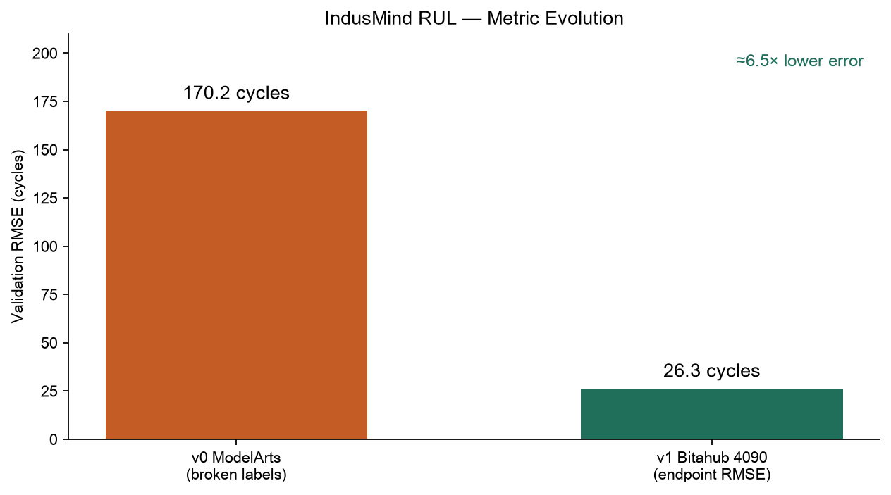
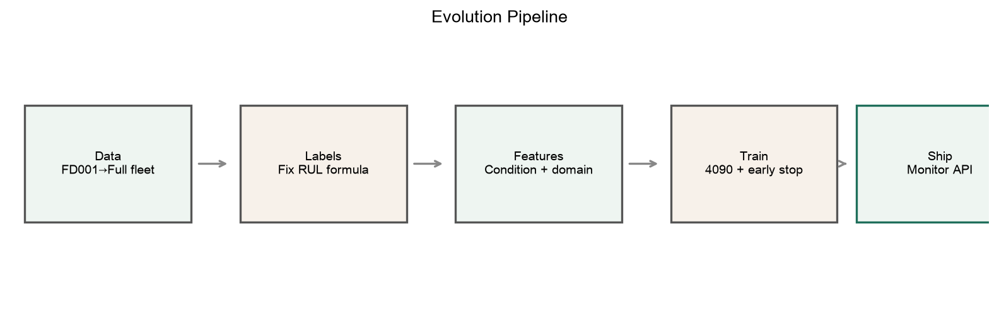
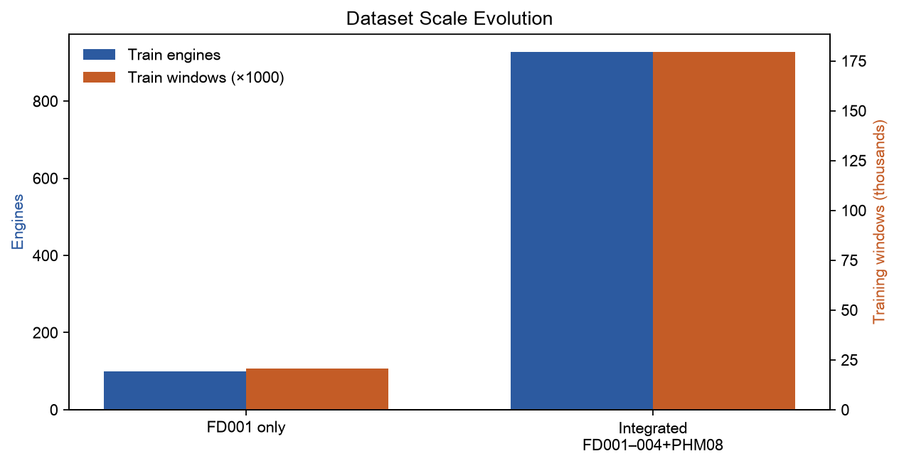
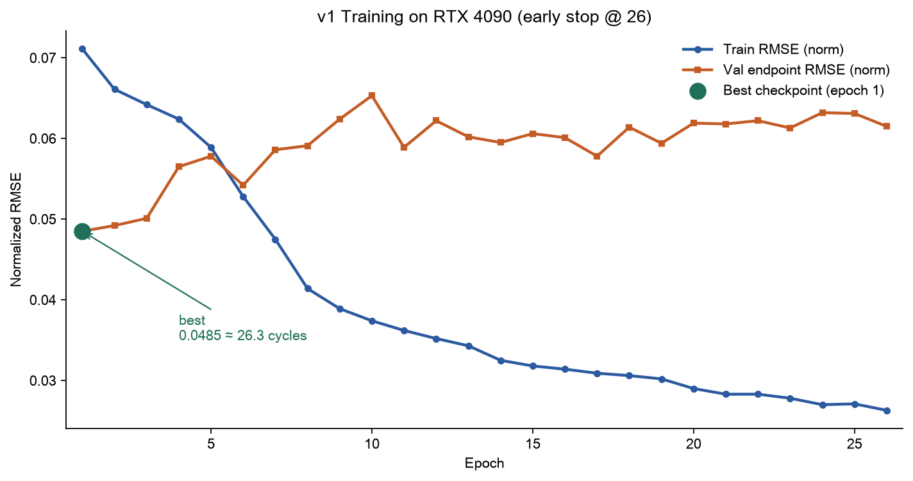

# IndusMind · 涡扇发动机 RUL 监测

NASA C-MAPSS 全家族 + PHM08 整合数据上的剩余寿命（RUL）预测基线，附统一监测 API。

<p align="center">
  
</p>

| 版本 | 验证 RMSE | 说明 |
|------|-----------|------|
| **v0** ModelArts V100 | ~170 cycles | 验证标签算反，不可用 |
| **v1** Bitahub RTX 4090 | **26.3 cycles** | 端点评估，可上线基线 |

相对 v0，误差约下降 **6.5 倍**——主要来自数据管道与评估协议，不是盲目加大网络。

---

## 目录

- [模型怎么进化](#模型怎么进化)
- [当前能力](#当前能力)
- [快速开始](#快速开始)
- [监测 API](#监测-api)
- [仓库结构](#仓库结构)
- [下一跳](#下一跳)

---

## 模型怎么进化

<p align="center">
  
</p>

### 1. 数据：从 FD001 到全家族

<p align="center">
  
</p>

| | FD001 only | 整合集 v1 |
|--|------------|-----------|
| 训练发动机 | 100 | **927** |
| 训练窗口 | ~2 万行级 | **179,394**（30×34） |
| 验证（有公开 RUL） | 100 | **707**（端点可用约 690） |
| 工况 / 故障 | 1 / 1 | 1&6 / 1&2 + PHM08 增广 |

原始三件套：`integrated/train_integrated.txt` · `val_integrated.txt` · `RUL_integrated.txt`  
说明见 [`integrated/DATASET.md`](integrated/DATASET.md)。

### 2. 关键修复：假过拟合 → 真标签

v0 在 V100 上 Train 降、Val 卡在 ~0.31，反算约 **170 cycles**。根因不是「模型太大」：

- 验证 RUL 公式写反 → 过半窗口为**负标签**
- 输出 ReLU 无法拟合负目标
- 训练/验证目标不一致

修好后：`RUL = final_rul + max_cycle - current_cycle`，并断言标签非负。

### 3. 特征与采样

| 项 | 旧 | 新 (v1) |
|----|----|---------|
| 归一化 | 全局 StandardScaler | **6 工况聚类**内标准化 |
| 域特征 | 无 | dataset one-hot（FD001–004 / PHM08） |
| 输入维 | ~23 | **34** |
| 采样 | 长寿命机占优 | **发动机均衡**采样 |
| 评估 | 全窗口 RMSE | **每台末窗口端点 RMSE** |

### 4. v1 训练曲线（RTX 4090）

<p align="center">
  
</p>

```text
Best RMSE (norm):     0.0485
Best RMSE (original): 26.27 cycles   ← epoch 1
Early stop:           epoch 26
Params:               ~596k  BiLSTM
Speed:                ~6–9 s/epoch
```

Train 后期仍在降，Val 未再刷新最佳 → 早停正确保住 epoch 1 检查点。

更细的文字版演进记录：[`MODEL_EVOLUTION.md`](MODEL_EVOLUTION.md)。

---

## 当前能力

```text
Input (B, 30, 34)
  → BiLSTM (hidden=128, layers=2)
  → Last ∥ Mean pool
  → MLP → RUL (cycles)
```

| 能力 | 状态 |
|------|------|
| 滚动 / 单点 RUL | ✅ |
| 工况感知预处理 | ✅ |
| 伪特征归因 `pseudo_attribution` | ✅ |
| 独立 anomaly_score / 正式 feature_attribution | ❌ → API 返回 `null` |

---

## 快速开始

### 环境（本地）

```bash
cd /Users/tincl/indus_data
uv sync
```

### 预处理（已跑过可跳过）

```bash
uv run python preprocess_integrated.py
```

### 训练（云上 GPU 推荐）

```bash
# Bitahub 等
bash run_bitahub.sh
# 日志
tail -f train.log
```

### 离线推理示例

```bash
/opt/conda/bin/python infer.py \
  --checkpoint model/saved/best_model.pt \
  --n-examples 5
```

### 启动监测 API

```bash
bash run_api.sh
# → http://127.0.0.1:8000/health
# → http://127.0.0.1:8000/docs
```

跨机调用需 SSH 隧道 + 前端代理，见 [`API_CONTRACT.md`](API_CONTRACT.md)。

---

## 监测 API

```http
POST /api/v1/monitor/analyze
```

必填：`device_id` · `device_model` · `sensor_data`(≥30，推荐 128) · `operating_settings` · `dataset`  

成功时返回 `rul_predicted` / `rul_series` / `pseudo_attribution`；异常分数字段为 `null`（不伪造）。

完整字段表与 TypeScript 类型：**[`API_CONTRACT.md`](API_CONTRACT.md)**

---

## 仓库结构

```text
indus_data/
├── README.md                 ← 你在这里
├── assets/                   ← README 配图（png）
│   ├── rmse_evolution.png
│   ├── evolution_pipeline.png
│   ├── dataset_scale.png
│   └── training_curve_v1.png
├── MODEL_EVOLUTION.md
├── API_CONTRACT.md
├── integrated/
├── processed/
├── train.py / infer.py / api.py
└── model/saved/
```

---

## 下一跳

1. 按 FD001–004 **分组**报端点 RMSE / NASA Score  
2. RUL cap（如 125）+ Huber Loss  
3. 在冻结数据管道上试 TCN-GRU-Attention  
4. 真正的异常头，填满 API 中的 `null` 字段  

---

## 引用

- Saxena et al., *Damage Propagation Modeling for Aircraft Engine Run-to-Failure Simulation*, PHM08  
- NASA PCoE C-MAPSS / PHM08 Challenge datasets  

---

**一句话：** 先把标签和工况做对，再用中等 BiLSTM 在全家族数据上拿到 **26.3 cycles** 端点 RMSE，并做成可调用的监测 API。
